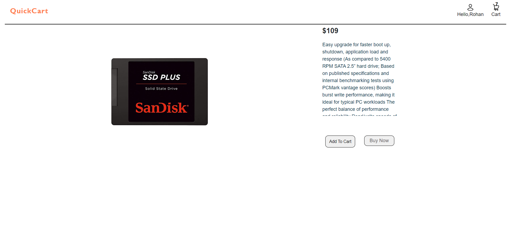
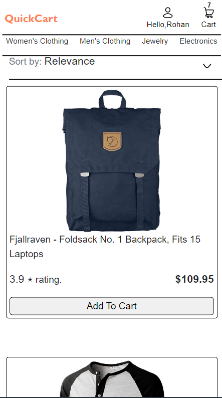
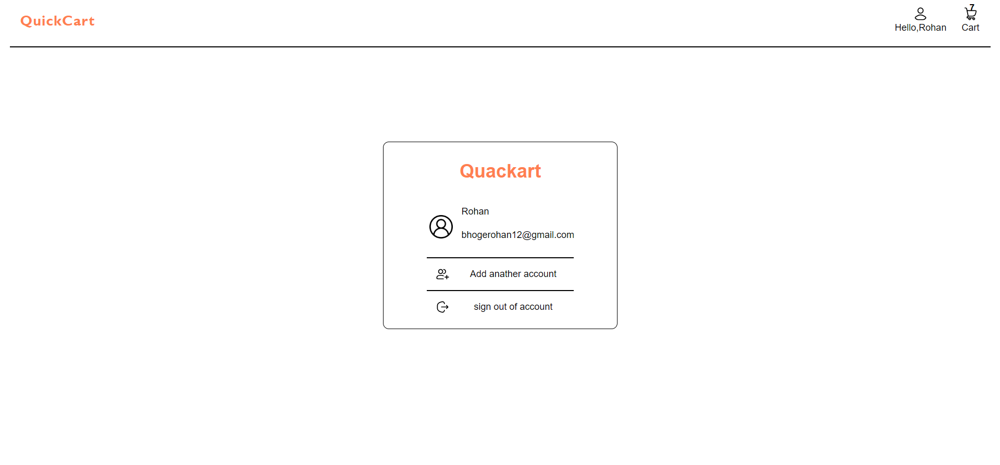
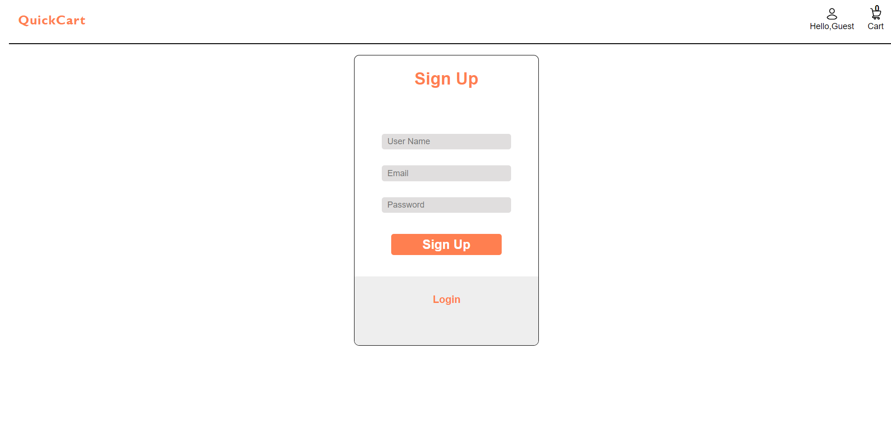
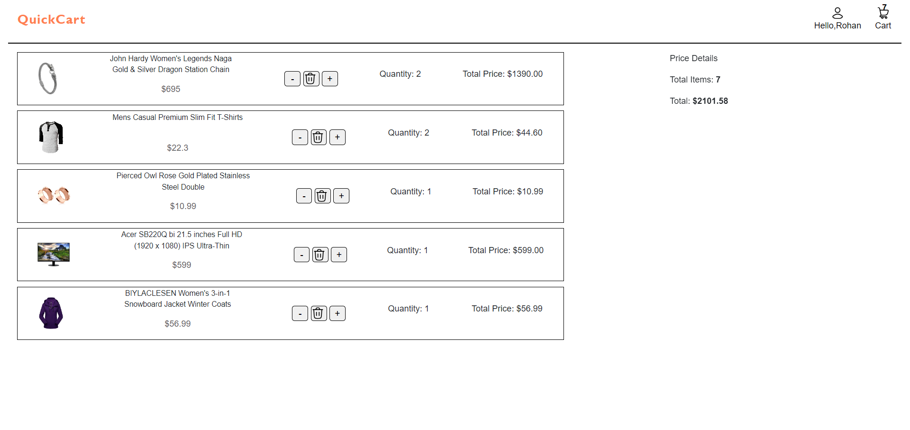

# E-commerce Website
This is a front-end e-commerce project built using React, CSS, and JavaScript. The website allows users to browse products, add items to their cart, and proceed to the login for checkout.

## Table of Contents
- [Preview](#preview)
- [Features](#features)
- [Installation](#installation)
- [Usage](#usage)
- [Contact](#contact)

# Preview

*omepage: Displays the product list and navigation options.*

*Product Page: Shows detailed information about a selected product.*

*Optimized for small screens with responsive layout adjustments.*

 
*Login Page: Allows users to log in and access their profile.*
 
*Cart Page: Manages cart items, quantities, and total cost.*

# Features
- **Product List**: Browse products on the homepage.
- **Product Pages**: View detailed product information.
- **Navbar**: Access cart and login pages via icons.
- **Categories**: Filter products by category.
- **Sorting**: Sort products by price, rating, or relevance.
- **User Profile**: Login page and display user info when logged in.
- **Cart Page**: Manage cart items, quantities, and total cost.
- **Home Navigation**: Return to the homepage by clicking the logo.

# Usage
After deploying or running the Quickcart project locally, users can interact with the e-commerce website as follows:

### 1. Homepage & Product List:

- Upon landing on the homepage, users will be greeted with a list of products.
- Clicking on any product will open a detailed Product Page for that item.
### 2. Navigation Bar:

- At the top, a Navigation Bar provides easy access to different parts of the site.
- The Cart Icon on the navbar will lead to the Cart Page, where users can review and manage their selected items.
- The Profile Icon will direct users to the Login Page. If logged in, users will see their profile information instead.
### 3. Product Categories:

- On the homepage, users can jump to specific Product Categories by selecting from the category list.
### 4. Product Sorting:

- Users can sort products using filters based on:
    - Price: Low-to-High and High-to-Low
    - Rating
    - Relevance
### 5. Login & Profile:

- Clicking on the Profile Icon will open the Login Page.
- Once logged in, users can see their profile information displayed in the navbar.
### 6. Cart Functionality:

- On the Cart Page, users will see a list of all items added to the cart.
- The page displays the total number of products, total quantity, and total cost.
- Users can increase/decrease the quantity of items or remove products from the cart.
### 7. Quickcart Logo Navigation:

- Clicking on the Quickcart logo from any page will always take the user back to the homepage.

# Deployment
The project is deployed and accessible at https://rohanbhoge.github.io/quackart/.

# Contact
- **Email**: [bhogerohan12@gmail.com](mailto:bhogerohan12@gmail.com)
- **GitHub**: [GitHub](https://github.com/RohanBhoge)
- **LinkedIn**: [LinkedIn](https://www.linkedin.com/in/rohanbhoge)

# Acknowledgments
- Thanks to the React community for the excellent documentation and support.
- Inspiration from various open-source projects and YouTube’s UI/UX design.