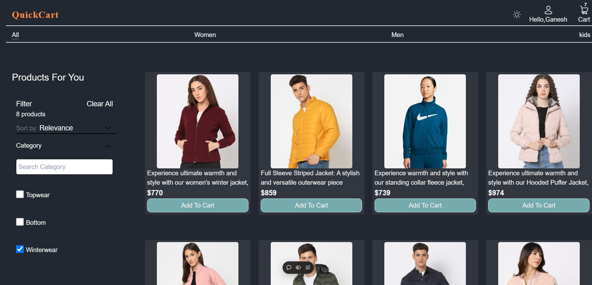
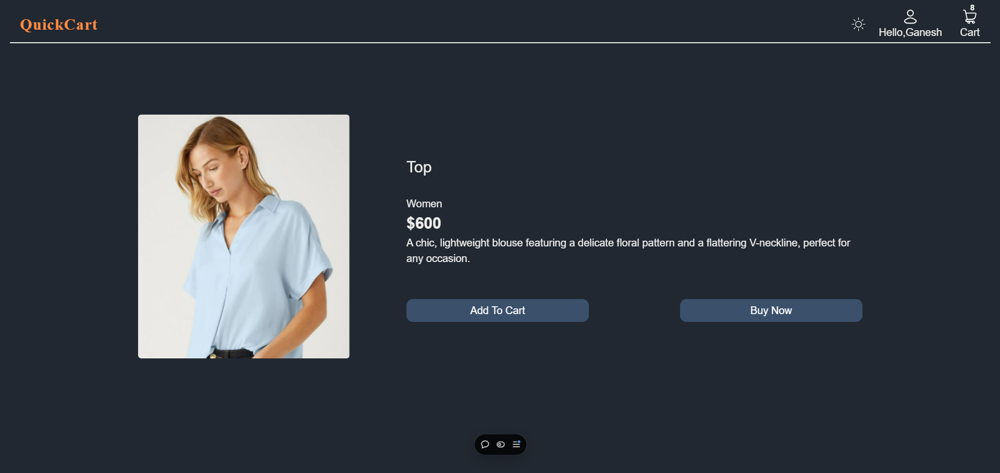
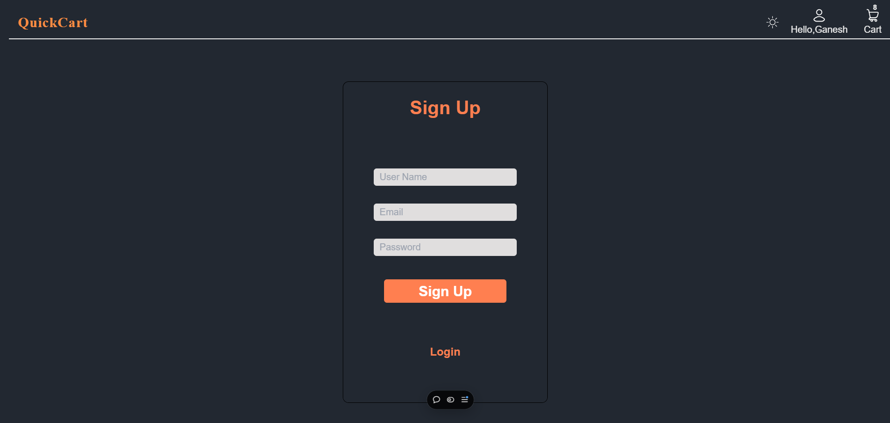
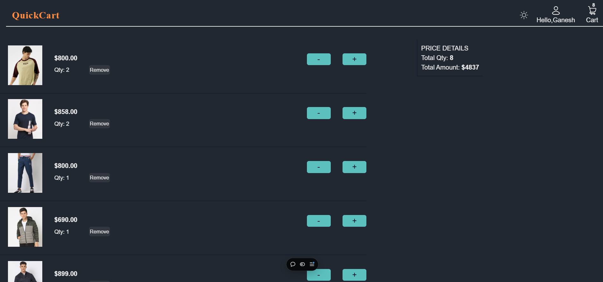

# Quickcart - Full-Stack E-commerce Website

Quickcart is a full-stack e-commerce application designed to provide users with an intuitive shopping experience. Built using the **MERN stack** (MongoDB, Express.js, React.js, and Node.js), this application supports functionalities like browsing products, user authentication, cart management, and order placement.

## Table of Contents
- [Preview](#preview)
- [Features](#features)
- [Technologies Used](#technologies-used)
- [Usage](#usage)
- [API Endpoints](#api-endpoints)
- [Contact](#contact)
- [Acknowledgments](#acknowledgments)

---

## Preview
  
*Homepage: Displays the product list and navigation options.*

  
*Product Page: Shows detailed information about a selected product.*

  
*Login Page: Allows users to log in and access their profile.*

  
*Cart Page: Manages cart items, quantities, and total cost.*

---

## Features

### Frontend:
- **Responsive Design**: Fully optimized for devices of all screen sizes.
- **Product Browsing**: List and filter products based on category, price, or rating.
- **Authentication**: Users can log in or sign up to access personalized features.
- **Cart Management**: Add/remove products, update quantities, and view totals.
- **Navigation**: Seamless navigation using React Router.

### Backend:
- **RESTful APIs**: Efficient data exchange between the frontend and backend.
- **User Authentication**: Secured user login using JWT (JSON Web Token).
- **Database**: MongoDB to store user profiles, product data, and cart details.
- **Error Handling**: Comprehensive error messages for user-friendly debugging.
- **Order Management**: Store and retrieve user orders.

---

## Technologies Used
- **Frontend**: React.js, CSS, React Router.
- **Backend**: Node.js, Express.js.
- **Database**: MongoDB (Atlas).
- **Deployment**: Vercel.
- **Tools**: Postman (API testing), Git, GitHub.
- **Version Control**: Git.

---
## Usage
After deploying or running the Quickcart project locally or on a server, users can interact with the e-commerce platform as follows:

1. **Starting the Application**:

- Access the website through the deployed URL or by running the application locally.

2. **User Authentication**

- New Users: Click on "Sign Up" to create an account. Fill in the required details and submit the form.
- Returning Users: Enter your credentials and log in.
3. **Homepage & Product Browsing**
Browse products on the homepage.
Click on a product to open its Product Page, where detailed information is displayed.

4. **Product Categories and Sorting**

- Use the **Category Filter** to view products within a specific category.
- Apply sorting options (e.g., price, rating, relevance) to refine your product search.
5. **Adding Products to Cart**
- On the Product Page, click the "Add to Cart" button.

6. **Cart Management**

- Navigate to the **Cart Page** via the cart icon in the navbar.
- Manage quantities, remove items, and view the total cost.
7. **Quickcart Logo Navigation**
Clicking the **Quickcart logo** redirects to the homepage.

8. **Logout**
Click on the **Logout** button in the navbar to end your session.
---

## API Endpoints
 **Authentication**
- `POST /api/user/register`: Register User.
- `POST /api/user/login`: User login.
- `GET /api/user/users`: Access registration.
- `GET /api/user/user-details`: Access user detail.

**Products**
- `GET /api/product/addlist`:Retrieves a list of products.
- `POST /api/product/remove`:Remove product from Database.

**Cart**
- `POST /api/cart/get`: Fetch user cart.
- `POST /api/cart/add`: Add items to the cart.
- `POST /api/cart/update`:id: Update item quantity.

---
# Deployment
The project is deployed and accessible at https://quackart.vercel.app/.

---
## Contact

Feel free to reach out to me through the following channels:

- **Email**: [bhogerohan12@gmail.com](mailto:bhogerohan12@gmail.com)
- **GitHub**: [RohanBhoge](https://github.com/RohanBhoge)
- **LinkedIn**: [Rohan Bhoge](https://www.linkedin.com/in/rohanbhoge)
---
## Acknowledgments
- Thanks to **MongoDB**, **Express.js**, **React.js**, and **Node.js** for providing robust tools for development.
- Gratitude to the open-source community for valuable resources and guidance.